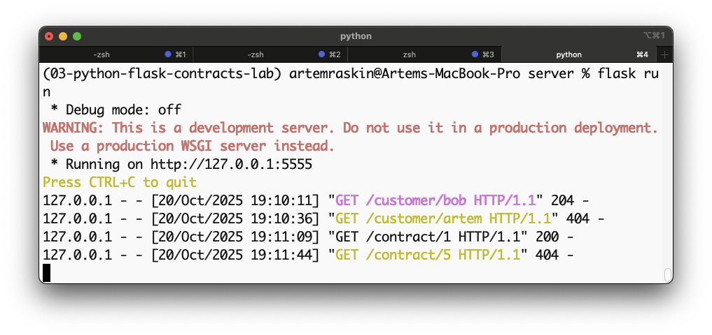
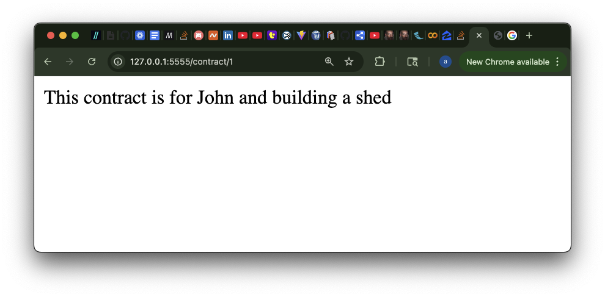

# Contractors Lab

This project is a simple **Flask** application that simulates working with contract and customer data.  
It contains two main routes: one for retrieving contract information and one for verifying customer existence.

---

## 🧭 How to Run

1. Install dependencies:
```bash
   pipenv install
```
2. Activate the virtual environment:
```bash
   pipenv shell
```
3. Run the server:
```bash
   python server/app.py
```
4. Open your browser and navigate to:
```bash
   http://127.0.0.1:5555
```
---

## 📦 Routes

### `/contract/<id>`
- Returns contract information if the ID exists.
- Response code `200` with contract text if found.
- Response code `404` if not found.

### `/customer/<customer_name>`
- Checks if a customer exists in the array.
- Response code `204` if found (empty body).
- Response code `404` if not found.

---

## 🖼️ Screenshots

### ✅ Server Output
This shows successful responses for `/contract` and `/customer` routes.  


### 🌐 Browser Output
Example of `/contract/3` response in the browser.  


---

## 🧰 Tech Stack
- Python 3
- Flask
- Pipenv

---
